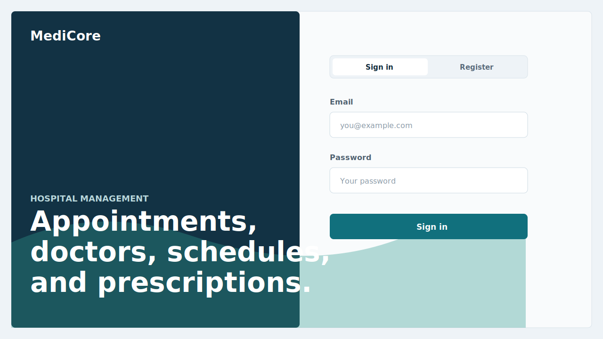
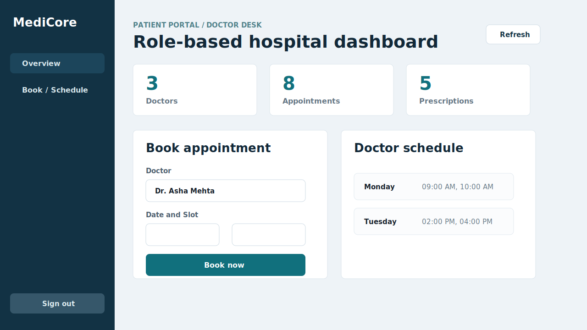
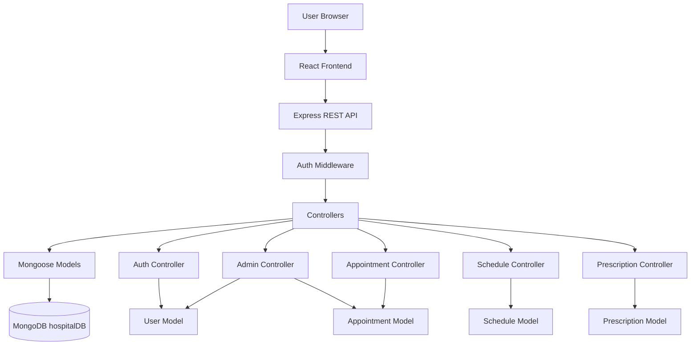
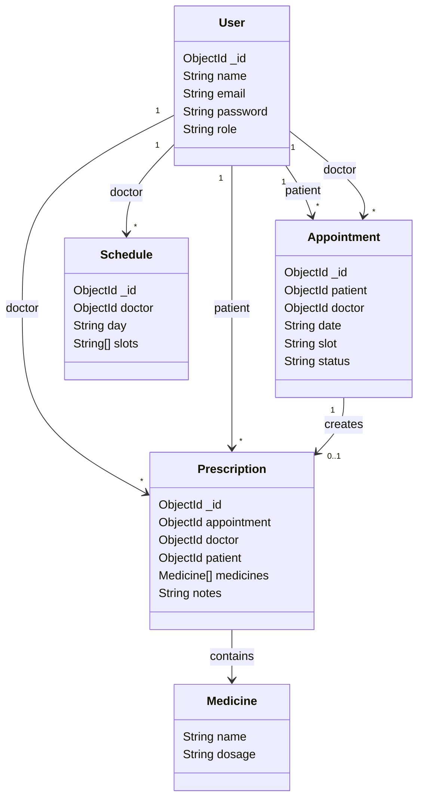
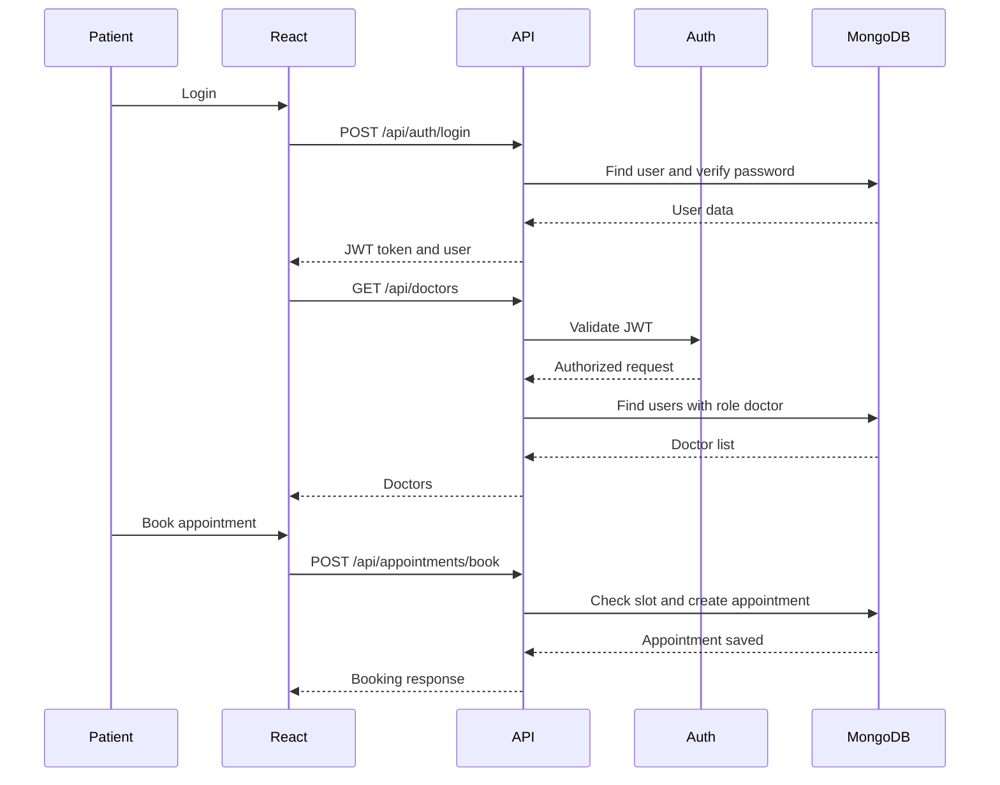

# Hospital Management System

A full-stack hospital management application built with React, Express, Node.js, and MongoDB. The system supports role-based workflows for patients, doctors, and admins.

## Screenshots

### Login and Registration



### Role-Based Dashboard



## Features

- Patient registration and login
- Doctor registration and login
- Admin registration and login
- JWT-based protected routes
- Patient appointment booking
- Doctor appointment management
- Doctor schedule creation
- Prescription creation and patient prescription view
- Admin dashboard statistics
- Doctor listing and doctor removal
- Responsive React frontend

## Tech Stack

| Layer | Technology |
| --- | --- |
| Frontend | React, Vite, Axios, CSS |
| Backend | Node.js, Express.js |
| Database | MongoDB, Mongoose |
| Authentication | JWT, bcryptjs |
| Tooling | ESLint, Nodemon |

## Project Structure

```text
hospital/
+-- backend/
|   +-- controllers/
|   +-- middleware/
|   +-- models/
|   +-- routes/
|   +-- config/
|   +-- server.js
+-- frontend/
|   +-- public/
|   +-- src/
|       +-- api/
|       +-- components/
|       +-- pages/
|       +-- App.jsx
|       +-- styles.css
+-- docs/
|   +-- screenshots/
+-- README.md
```

## HLD



## LLD



## Request Flow



## API Overview

| Method | Endpoint | Access | Description |
| --- | --- | --- | --- |
| POST | `/api/auth/register` | Public | Register a user |
| POST | `/api/auth/login` | Public | Login and receive JWT |
| GET | `/api/doctors` | Logged in users | List doctors |
| GET | `/api/admin/stats` | Admin | Dashboard stats |
| DELETE | `/api/admin/doctor/:id` | Admin | Remove doctor |
| POST | `/api/appointments/book` | Patient | Book appointment |
| GET | `/api/appointments/patient` | Patient | Patient appointments |
| GET | `/api/appointments/doctor` | Doctor | Doctor appointments |
| PUT | `/api/appointments/update/:id` | Doctor | Update appointment status |
| POST | `/api/schedules/create` | Doctor | Create schedule |
| GET | `/api/schedules/:id` | Logged in users | Get doctor schedule |
| POST | `/api/prescriptions/create` | Doctor | Create prescription |
| GET | `/api/prescriptions/my` | Patient | Get patient prescriptions |

## Local Setup

### Backend

```bash
cd backend
npm install
npm start
```

The backend runs on:

```text
http://localhost:5000
```

MongoDB should be running locally at:

```text
mongodb://127.0.0.1:27017/hospitalDB
```

### Frontend

```bash
cd frontend
npm install
npm run dev
```

The frontend usually runs on:

```text
http://localhost:5173
```

If port `5173` is busy, Vite will automatically use the next free port.

## Environment Variables

Create `backend/.env`:

```env
JWT_SECRET=your_jwt_secret_here
```

The project includes a development fallback JWT secret, but a real secret should be used for local and production work.

## Run Checks

```bash
cd frontend
npm run lint
npm run build
```

```bash
cd backend
node --check server.js
```

## Roles

| Role | Capabilities |
| --- | --- |
| Patient | Book appointments, view appointments, view prescriptions |
| Doctor | Create schedules, view appointments, update appointment status, create prescriptions |
| Admin | View stats, view doctors, remove doctors |

## Repository

[GitHub Repository](https://github.com/MridulSinghSoam/hosptial-management)
